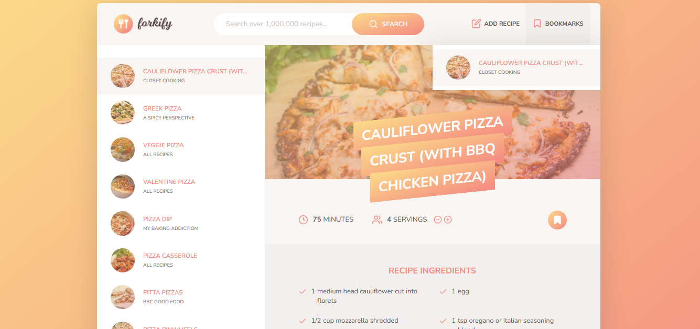

<div id="top"></div>


<!-- PROJECT LOGO  -->
<br />
<div align="center">
<a href="https://forkify-js-master.vercel.app/">
    
</a>

<h1>Forkify</h1>

  <p align="center">
    <a href="https://forkify-js-master.vercel.app/">View Demo</a>
    ·
    <a href="https://github.com/SalahShallapy/Forkify/issues">Report Bug</a>
  </p>
</div>

Forkify is a modern web application designed to search for, view, and manage recipes sourced from an external API. Users can explore thousands of recipes, bookmark their favorites for quick access, and even create and upload their own recipes. The application features dynamic rendering, pagination for smoother navigation.

## Project Overview



### Flowchart


### Architecture


## Features:

- Recipe Search: Search for recipes by name or ingredient.
- Recipe Details: View detailed instructions, ingredients, and cooking time.
- Bookmark System: Save and manage favorite recipes.
- Custom Recipe Uploads: Add your own recipes to the app.
- Pagination: Browse search results efficiently.

## Usage:

1. Open the application in your web browser.
2. Use the search bar to look for recipes based on keywords.
3. Select a recipe to view detailed information.
4. Bookmark your favorite recipes for future reference.
5. Add your own recipes using the upload feature.
6. Navigate through pages of search results using the pagination feature.

## Tree structure

```
Forkify
│   .gitignore
│   .prettierrc
│   index.html
│   package-lock.json
│   package.json
│   README.md
│
└───src
    ├───img
    │       favicon.png
    │       forkify-architecture-recipe-loading.png
    │       forkify-flowchart.png
    │       icons.svg
    │       logo.png
    │       preview.png
    │
    ├───js
    │   │   config.js
    │   │   controller.js
    │   │   helpers.js
    │   │   model.js
    │   │
    │   └───views
    │           addRecipeView.js
    │           bookmarksView.js
    │           paginationView.js
    │           previewView.js
    │           recipeView.js
    │           resultsView.js
    │           searchView.js
    │           View.js
    │
    └───sass
            main.scss
            _base.scss
            _components.scss
            _header.scss
            _preview.scss
            _recipe.scss
            _searchResults.scss
            _upload.scss
```

## Installation

1. Clone the repo
   ```bash
   git clone https://github.com/SalahShallapy/Forkify
   ```
2. Go to project folder

```bash
cd forkify
```

3. install dependencies

```bash
npm install
```

4. Run start script

```bash
npm start
```

## Notes

- Api Endpoints : [Forkify API](https://forkify-api.herokuapp.com/v2)
- Available search queries : [Queries](https://forkify-api.herokuapp.com/phrases.html)

## Contributing

Contributions are what make the open source community such an amazing place to learn, inspire, and create. Any contributions you make are **greatly appreciated**.

If you have a suggestion that would make this better, please fork the repo and create a pull request. You can also simply open an issue with the tag "enhancement".
Don't forget to give the project a star! Thanks!

1. Fork the Project
2. Create your Feature Branch (`git checkout -b feature/AmazingFeature`)
3. Commit your Changes (`git commit -m 'Add some AmazingFeature'`)
4. Push to the Branch (`git push origin feature/AmazingFeature`)
5. Open a Pull Request

<p align="right">(<a href="#top">back to top</a>)</p>
